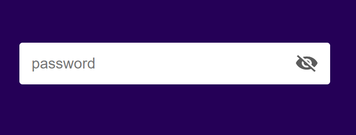

# Hide and Show Password 👁️🔒

## Overview
The *Hide and Show Password* is a simple web component that enhances user experience by allowing them to toggle between hiding and showing the password input. This feature is particularly useful for users who want to verify their entered password or view it while typing.

## Technologies Used 🚀
- **HTML**
- **CSS**
- **JavaScript**

## Usage 💻
1. **Password Input:**
   - Enter your password in the password input field.
2. **Toggle Visibility:**
   - Click on the eye icon next to the password input to toggle between hiding and showing the password.
   - When the eye is closed the password is hidden.
   - When the eye is open the password is visible.
   

## Live Demo 🌐
Live Demo: 

## Installation
No special installation is required for this project. Simply download the project files and open the `index.html` file in a web browser.

## Contributing 🤝
Feel free to use, modify, and contribute to the project! If you have any questions or feedback, you can reach me at nisagokdemir@gmail.com

## License
This project is licensed under the **MIT License**.
